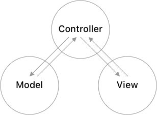
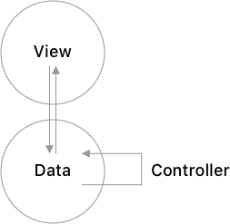
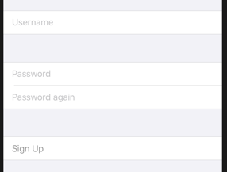
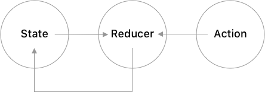
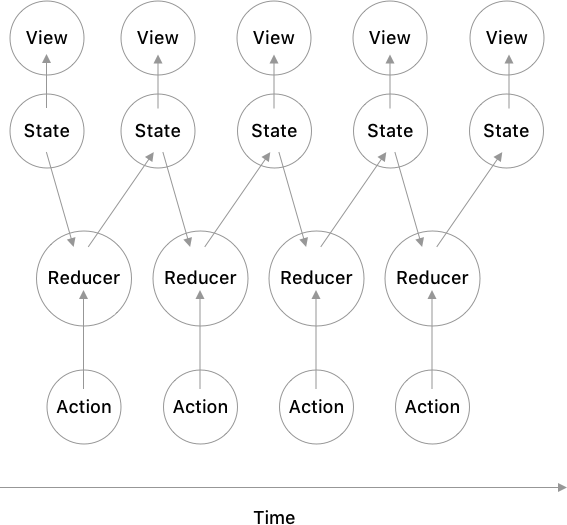
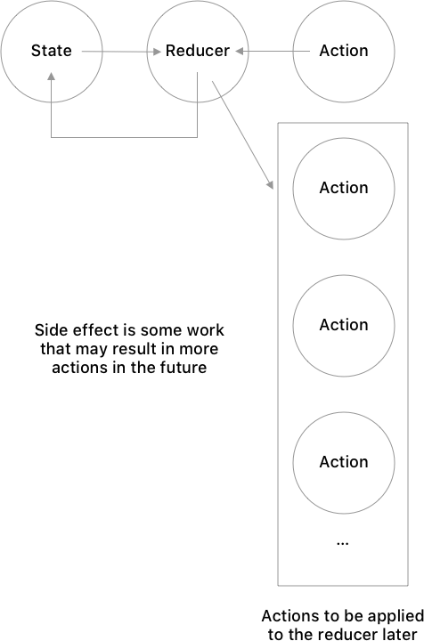
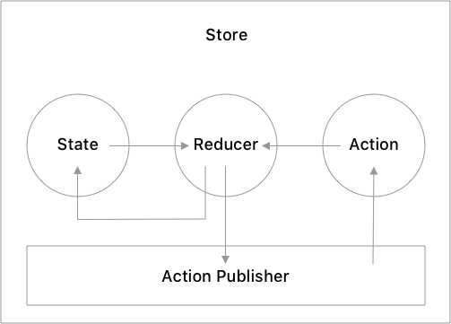

# App Architecture for SwiftUI

### Intro

In UIKit, the central object is the view controller. It manages the changes and the lifecycle of the model and the view, as well as the communication between the model and the view.
<p align="center">
  
</p>

An iOS app is essentially a tree of view controllers.
<p align="center">
  
</p>

In SwiftUI, the framework itself manages the view changes, lifecycle, and communication with the model. Additionally, the view is connected to data via observable state, which significantly reduces the role of a controller object. It can no longer be a view controller because SwiftUI controls the view, and its data management is limited to updating the data that should be in the data model object to be easily observable by the view. Given its much simpler role in SwiftUI, it becomes natural to either not have a controller at all, putting all the logic for changing the model state into the model itself, or to turn it into a simple function that updates the model.
<p align="center">
  
</p>

Another important difference from UIKit, is that in SwiftUI a view is conceptually a  visual snapshot of the data, where the snapshot gets updated on any change in the data. This makes it natural to model data changes as streams of data, where the logic is expressed in the way that streams are composed.
<p align="center">
  
</p>

WWDC showed a few examples of this style where a password form login button was enabled or disabled based on the result of combining data streams from user input. While these data transformation chains are very elegant, this style isn't scalable because the transformation chains can be easily entangled so that code changes in one chain may unexpectedly affect other chains. Additionally, this style doesn't provide an easy way to see what happens to the model over time. It is possible to set a breakpoint on the body property of a SwiftUI view and dump all the variables there, but that doesn't show what triggers the change in the state and so isn't that useful for debugging. Testing is also problematic: it is possible to test one data transformation chain, but testing the changes to the model as a whole is nearly impossible.

### Example

We will look at a similar example:
<p align="center">
  
</p>

Initially, the form should be empty. After the user pauses typing, if the username is invalid, the UI should show a red message below the username. Similarly, when the user types in the password, there should be no red message below, but if the password is invalid when the user pauses typing, the message should tell that the password is invalid. If the user types in the password again and they don't match, the user should see this after pausing typing the second password but not before pausing. If the user enters different passwords and the first password is invalid, after pausing typing, the user should see the message about the invalid password, not different passwords. As soon as the user starts typing again, the relevant messages should disappear. Finally, Sign Up should be enabled exactly when the username is valid, the password is valid, and the second password is the same. This should be independent of typing so that the user cannot possibly tap on Sign Up with invalid data.

That is a lot of conditions and a lot of state to keep track of! Doing all of this with stream transformations is possible but not easy. Instead, we'll look at a different architecture that is similar to MVC and is much easier to follow and test.

### The Reducer

The pattern that MVC naturally transforms into with SwiftUI is very similar to the reducer architecture. It has many variants (just like MVC), but the main idea is that there is a model, often called state, and a function, the reducer, that takes the state and an action and transforms (reduces) the state based on the action.
<p align="center">
  
</p>

In our example, the state could be
```Swift
struct State {
    var username = ""
    var usernameMessage = ""
    var password = ""
    var passwordMessage = ""
    var passwordAgain = ""
    var canSignUp = false
    ...
}
```
The action could be
```Swift
enum Action {
    case updateUsername(String)
    case updatePassword(String)
    case updatePasswordAgain(String)
    case updateUsernameMessage
    case updatePasswordMessage
    case showSignUpUI
    case hideSignUpUI
}
```
and the reducer could be
```Swift
func reducer(state: inout State, action: Action) {
   ...
}
```

There is some similarity to OOP in that only the reducer changes the state, and that there is a predefined list of actions:
```Swift
class State {
    private(set) var username = ""
    private(set) var usernameMessage = ""
    private(set) var password = ""
    private(set) var passwordMessage = ""
    private(set) var passwordAgain = ""
    private(set) var canSignUp = false

    func updateUsername(_ username: String) { ... }
    func updatePassword(_ password: String) { ... }
    func updatePasswordAgain(_ password: String) { ... }
    func updateUsernameMessage() { ... }
    func updatePasswordMessage() { ... }
    func showSignUpUI() { ... }
    func hideSignUpUI() { ... }
}
```

One crucial difference is that the reducer is a pure function – it uses only the state and the action to derive the new state and does not change anything except updating the state (or returning a new one). Another difference, almost as important as the first, is that an object defines the actions as public methods while the reducer unifies actions under one type, which makes it possible to separate actions from its object and compose them into a sequence of actions (or a Publisher, using Combine terminology). It also makes testing much easier because actions can be saved and replayed when testing, while the state can be compared to the expected state after each action.

The state, reducer, and a sequence of actions also provide a way to see how the state changes over time, and since a SwiftUI view is always a reflection of the state, the UI always updates in a predictable way.
<p align="center">
  
</p>

In our example, the sequence of actions could be
```Swift
[
   .updateUsername("i", 
   .updateUsername("il",
   .updateUsername("ily",
   .updateUsername("ilya",
   .updatePassword("t"),
   .updatePassword("te"),
   .updatePassword("tes"),
   .updatePassword("test")
 ]
```
and the view would update with the new text after every action.

A class can be written to resemble this pattern, but a struct for the state and an enum for actions provide much more compiler help to enforce it.

### Side Effects

In addition to updating the state, the reducer also needs a way to describe side effects – code that does something other than synchronously changing the state (synchronous state change must happen in the reducer).  Some examples:  a network request, logging,  writing data to disk. If the state needs to be updated as a result of running a side effect (for example an update from the network response), it's achieved by sending an action to the reducer. This creates a unidirectional data flow where the reducer is the only part of the code that changes the state.

In our example, a side effect could be an action to indicate that the user has stopped or paused typing.

One way to describe this asynchronous work is to use Future<Action>. This would describe one asynchronous action. A more general approach that describes multiple asynchronous actions is to use [Future<Action>], but the most general way is to use a Publisher for actions. This is more general than an array (an array can be easily converted to a publisher) and describes any possible asynchronous work that might even repeat forever at random times.
<p align="center">
  
</p>
  
In our example, the side effect of paused typing can be described when constructing the UI and would repeat at random times while the form is active.

### The Store

Given the state and an action, the reducer updates the state and returns the side effects to be executed later, but some other object needs to own the state, call the reducer to update the state in response to an action, and to run side effects. That object is usually called the store. In the case of SwiftUI, it's an observable object where the state is a published property.
<p align="center">
  
</p>

### Multiple Views

The last architectural issue before looking at the specifics of the implementation is the interaction between multiple views. With the reducer architecture, it's popular to combine multiple State / Reducer / Action triplets into a single mega State / Reducer / Action that describes the whole app. While it's an interesting mathematical fact that reducers can be composed into a mega reducer and it may be useful in some contexts, it doesn't work well for app development.

The most important problem is performance.  If a view hierarchy is large (and it typically is with any non-trivial mobile app) or if some view generates many actions, going through the app-wide reducer and updating the whole view hierarchy is very inefficient. Even if the user doesn't see any difference on the screen because the processor can keep up, in one of my tests, this caused a 3 to 4 times larger CPU load, which is not good for battery life.

Another problem with this approach is code locality. For code to be easily maintainable, most changes should affect only a small portion of the app. With a global app state, any change in the app triggers changes in the file for the global app state, which can easily lead to merge conflicts – it's the same problem as having a single storyboard for the whole app, which is manageable when the app is small but quickly becomes a burden as the app becomes larger.

A third problem is the amount of boilerplate code. A global state must provide translations for both actions and state. While some of this code is unavoidable to allow communication between different parts of the app, a global state has to store the data and provide translations for every view in the view hierarchy.

An alternative approach is to treat changes in the child view as side effects. The parent store can subscribe to receive actions from the child store, treating the child store updates as an effect. This provides the most flexibility (the stream of actions from the child store can be easily transformed as any other stream, for example by grouping multiple updates into one, or by getting the updates only when some conditions are met, etc). It also taps into the existing mechanism for delivering actions, which minimizes the amount of boilerplate code. Additionally, it's much more efficient since this communication is only between the parts of the UI that needs to be updated, and the updates are triggered only as necessary. It's a difference between O(1) and O(N) where N is the number of nodes in the view hierarchy.

## The Complete Example

Here is how our example can be implemented with this architecture. First, let's define the state for this form:
```Swift
struct State {
    var username = ""
    var usernameMessage = ""
    var password = ""
    var passwordMessage = ""
    var passwordAgain = ""
    var canSignUp = false
    var userNameValidationState: UsernameValidationState
    var passwordValidationState: PasswordValidationState
    var showSignUpUI = false

    init() {
        userNameValidationState = SignUp.validateUsername(username)
        passwordValidationState = SignUp.validatePassword(password, passwordAgain)
    }
}

enum UsernameValidationState {
    case valid
    case tooShort

    var message: String {
        switch self {
        case .valid: return ""
        case .tooShort: return "Username must at least have 3 characters"
        }
    }
}

enum PasswordValidationState {
    case passwordEmpty
    case differentPasswords
    case tooShort
    case valid

    var message: String {
        switch self {
        case .passwordEmpty: return "Password must not be empty"
        case .differentPasswords: return "Passwords don't match"
        case .tooShort: return "Password not strong enough"
        case .valid: return ""
        }
    }
}    
```

Next, define the actions:
```Swift
enum MutatingAction {
    case updateUsername(String)
    case updatePassword(String)
    case updatePasswordAgain(String)
    case updateUsernameMessage
    case updatePasswordMessage
    case showSignUpUI
    case hideSignUpUI
}
```

the reducer:
```Swift
static let reducer = Reducer { state, action in
    defer {
        state.canSignUp =
            state.userNameValidationState == .valid &&
            state.passwordValidationState == .valid
    }

    switch action {
    case .updateUsername(let username):
        state.username = username
        state.userNameValidationState = validateUsername(state.username)
        state.usernameMessage = ""

    case .updatePassword(let password):
        state.password = password
        state.passwordValidationState = validatePassword(state.password, state.passwordAgain)
        state.passwordMessage = ""

    case .updatePasswordAgain(let passwordAgain):
        state.passwordAgain = passwordAgain
        state.passwordValidationState = validatePassword(state.password, state.passwordAgain)
        state.passwordMessage = ""

    case .updateUsernameMessage:
        state.usernameMessage = state.userNameValidationState.message

    case .updatePasswordMessage:
        if (state.passwordValidationState == .differentPasswords) && state.passwordAgain.isEmpty {
            state.passwordMessage = ""
        }
        else {
            state.passwordMessage = state.passwordValidationState.message
        }

    case .showSignUpUI:
        state.showSignUpUI = true

    case .hideSignUpUI:
        state.showSignUpUI = false
    }

    return nil
}
```

and the helper functions:
```Swift
static func validateUsername(_ username: String) -> UsernameValidationState {
    username.count >= 3 ? .valid : .tooShort
}

static func validatePassword(_ password: String, _ passwordAgain: String) -> PasswordValidationState {
    if password.isEmpty {
        return .passwordEmpty
    }
    else if password.count < 5 {
        return .tooShort
    }
    else if password != passwordAgain {
        return .differentPasswords
    }
    else {
        return .valid
    }
}
```

The next step is to connect the state to the UI. To connect the text fields, we need to use bindings. The state in the store is read only (it can be modified only through actions), so we can't use SwiftUI built-in two way bindings. Instead, the store has a generic way to bind text changes to actions:
```Swift
TextField(
    SignUp.usernameLabel,
    text: store.binding(\.username, { .updateUsername($0) })
)
```
next, the error messages:
```Swift
Section(footer: errorText(store.state.usernameMessage))
```
where `errorText` is
```Swift
func errorText(_ content: String) -> Text {
    Text(content).foregroundColor(.red)
}
```
and finally the sign up button:
```Swift
Button(
    SignUp.signUpLabel,
    action: { self.store.send(.mutating(.showSignUpUI)) }
)
.disabled(!store.state.canSignUp)
```

The code captures all of the requirements, except those that are about timing. For that, we need the code that says when to send the actions. Here is how we can express that the user paused typing:
```Swift
static func pausedTyping(_ store: Store, keyPath: KeyPath<State, String>, action: MutatingAction) 
-> Reducer.Effect {
    store
        .updates(on: keyPath)
        .debounce(for: 0.8, scheduler: RunLoop.main)
        .map { _ in
            .mutating(action)
        }
        .eraseToAnyPublisher()
}
```
It describes how to make a data transformation chain. To use this for all text fields, when we make the store, we add 3 effects that keep running while the form is there:
```Swift
static func store() -> SignUp.Store {
    let store = Store(State(), reducer: reducer)
    store.addEffect(pausedTyping(store, keyPath: \.username, action: .updateUsernameMessage))
    store.addEffect(pausedTyping(store, keyPath: \.password, action: .updatePasswordMessage))
    store.addEffect(pausedTyping(store, keyPath: \.passwordAgain, action: .updatePasswordMessage))
    return store
}
```

Most of the code snippets describe static functions that don't have any state and instead describe data transformations, which makes them easy to follow and easy to test. The only code that isn't easily testable is the code that tells when to send actions, but it's very simple and is either tied directly to SwiftUI and Combine or uses the architecture helper methods that don't need tests in every app.

## Architecture Implementation

A reducer that takes the state as an inout parameter is the expected definition of the reducer, but any call to this reducer forces a state change update in the observable object (the store) because the reducer could potentially change the state, since it's an inout parameter. This state change update forces an update in the view hierarchy that references that store. To avoid the overhead, this implementation has 2 functions – one that has an inout parameter for the state, and the other where the parameter doesn't change:
```Swift
let run: (inout Value, MutatingAction) -> Effect?
let effect: (Value, EffectAction) -> Effect
```
And because there are 2 functions, the reducer is a struct, containing these functions. The first one that takes a mutating action may not have any effects, so it returns an optional Effect while the second one has to have an effect (otherwise it would not be doing anything useful), so it's not optional.

In addition to the optimization, the code makes it much more visible at the call site which actions change the state and groups the reducer code into 2 parts that describe how the state is mutated and how other actions initiate effects.

### Effects

The store has a `send` method for sending actions to the reducer, which is the only way to modify the state. The view layer uses this method to send actions to the store. Actions that are produced by effects are sent to the store the same way.
In this implementation, an effect is publisher that provides actions, and the store has a passthrough subject for effects, so it's a publisher of publisher of actions. The store flattens this steam and subscribes to receive values on the main thread. Whenever it receives a new value, it sends it to the reducer via the `send` method:
```Swift
public class StateStore<State, MutatingAction, EffectAction>: ObservableObject {
    public typealias Reducer = StateReducer<State, MutatingAction, EffectAction>

    private let reducer: Reducer
    private var subscriptions = Set<AnyCancellable>()
    private var effects = PassthroughSubject<Reducer.Effect, Never>()

    @Published public private(set) var state: State

    public init(_ initialValue: State, reducer: Reducer) {
        self.reducer = reducer
        self.state = initialValue

        subscriptions.insert(
            effects
                .flatMap { $0 }
                .receive(on: RunLoop.main)
                .sink(receiveValue: { [weak self] in self?.send($0) })
        )
    }

    func addEffect(_ effect: Reducer.Effect) {
        effects.send(effect)
    }

    public func send(_ action: Reducer.Action) {
        let effect: Reducer.Effect?
        switch action {
        case .mutating(let mutatingAction):
            effect = reducer.run(&state, mutatingAction)
        case .effect(let effectAction):
            effect = reducer.effect(state, effectAction)
        case .noAction:
            effect = nil
        }

        if let e = effect {
            addEffect(e)
        }
    }
```

### Helper Functions

Since the state is read only and can be changed only by the reducer through an action, we can't use the SwiftUI binding from the `$` operator. Instead, we have
```Swift
func binding<Value>(_ keyPath: KeyPath<State, Value>, _ action: @escaping (Value) -> MutatingAction) 
-> Binding<Value> {
    return Binding(get: { self.state[keyPath: keyPath] }, set: { self.send(.mutating(action($0))) })
}
```

Another common task is to get updates from the store when a property changes. Any change in the store state would trigger a new value, so it's important to remove duplicates. We also need to drop the first element to get only the updates:
```Swift
public func updates<Value>(
    on keyPath: KeyPath<State, Value>,
    compare: @escaping (Value, Value) -> Bool) -> AnyPublisher<Value, Never> {
    $state
        .map(keyPath)
        .removeDuplicates(by: compare)
        .dropFirst()
        .eraseToAnyPublisher()
}

public func updates<Value: Comparable>(on keyPath: KeyPath<State, Value>)
-> AnyPublisher<Value, Never> {
    updates(on: keyPath, compare: ==)
}
```

To connect multiple views, we often need to bind updates from a property of another view's store to an action for the first store. We can express this as an effect:
```Swift
public func bind<OtherState, OtherValue, OtherMutatingAction, OtherEffectAction>(
    to otherStore: StateStore<OtherState, OtherMutatingAction, OtherEffectAction>,
    on keyPath: KeyPath<OtherState, OtherValue>,
    with action: @escaping (OtherValue) -> Reducer.Action,
    compare: @escaping (OtherValue, OtherValue) -> Bool
) {
    addEffect(
        otherStore
            .updates(on: keyPath, compare: compare)
            .map { action($0) }
            .eraseToAnyPublisher()
    )
}

public func bind<OtherState, OtherValue: Comparable, OtherMutatingAction, OtherEffectAction>(
    to otherStore: StateStore<OtherState, OtherMutatingAction, OtherEffectAction>,
    on keyPath: KeyPath<OtherState, OtherValue>,
    with action: @escaping (OtherValue) -> Reducer.Action) {
    bind(to: otherStore, on: keyPath, with: action, compare: ==)
}
```

## Other Examples

An alternate implementation of the PointFree example app using this architecture<br>
https://github.com/ilyathewhite/PointFree-PrimeTime-Alt

A performance test that shows the problems with the global reducer<br>
https://github.com/ilyathewhite/PerformanceTest


## References

PointFree video series<br>
https://www.pointfree.co

Reducer blog entry by Chris Eidhof<br>
https://chris.eidhof.nl/post/reducers/

Reducer blog entry by Matt Gallagher<br>
http://www.cocoawithlove.com/blog/statements-messages-reducers.html

The WWDC based approach for the password form<br>
https://medium.com/flawless-app-stories/swiftui-plus-combine-equals-love-791ad444a082
